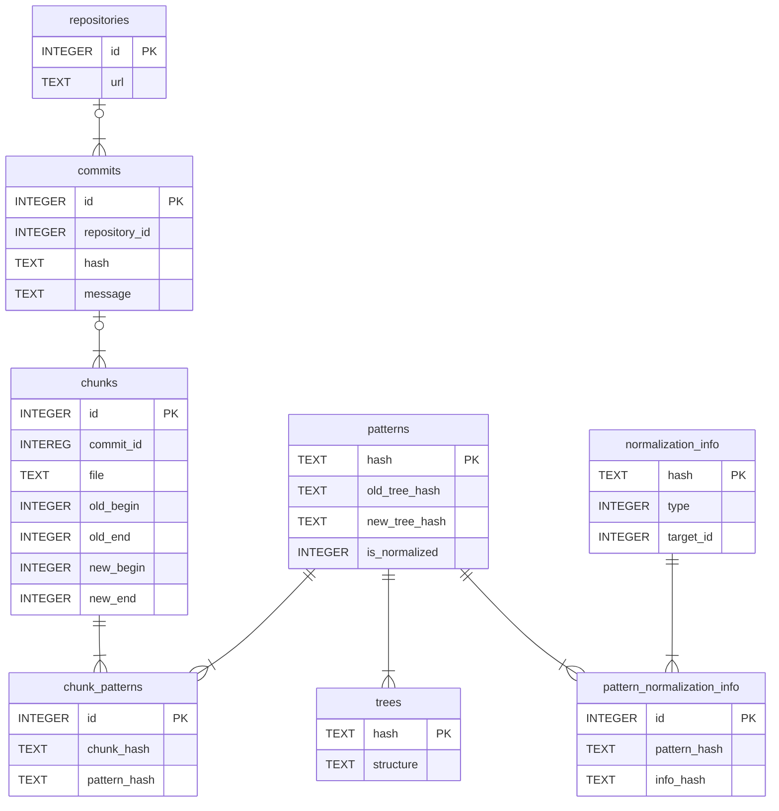

# ER図

```mermaid
erDiagram

repositories |o--|{ commits:""
commits |o--|{ chunks:""

chunks ||--|{ chunk_patterns: ""
patterns ||--|{ chunk_patterns:""

patterns ||--|{ trees :""

patterns ||--|{ pattern_normalization_info:""
normalization_info ||--|{ pattern_normalization_info:""


repositories{
    INTEGER id PK
    TEXT url
}

commits{
    INTEGER id PK
    INTEGER repository_id
    TEXT hash
    TEXT message
}

chunks{
    INTEGER id PK
    INTEREG commit_id
    TEXT file
    INTEGER old_begin
    INTEGER old_end
    INTEGER new_begin
    INTEGER new_end
}

patterns{
    TEXT hash PK
    TEXT old_tree_hash
    TEXT new_tree_hash
    INTEGER is_normalized
}

normalization_info{
    TEXT hash PK
    INTEGER type
    INTEGER target_id
}

trees{
    TEXT hash PK
    TEXT structure
}

chunk_patterns{
    INTEGER id PK
    TEXT chunk_hash
    TEXT pattern_hash
}

pattern_normalization_info{
    INTEGER id PK
    TEXT pattern_hash
    TEXT info_hash
}

```
